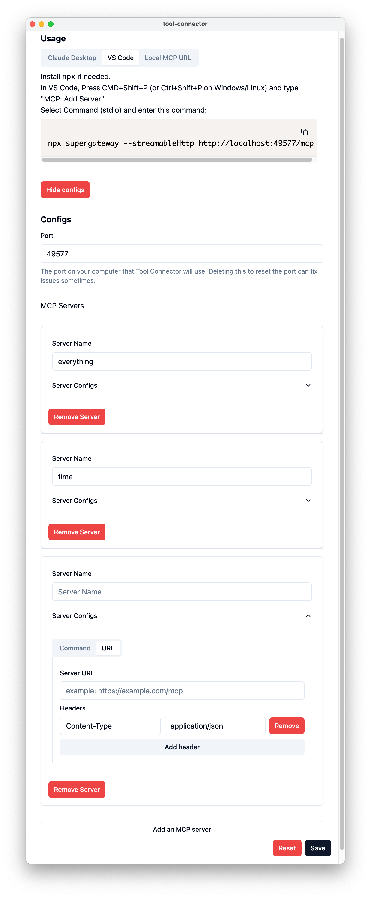
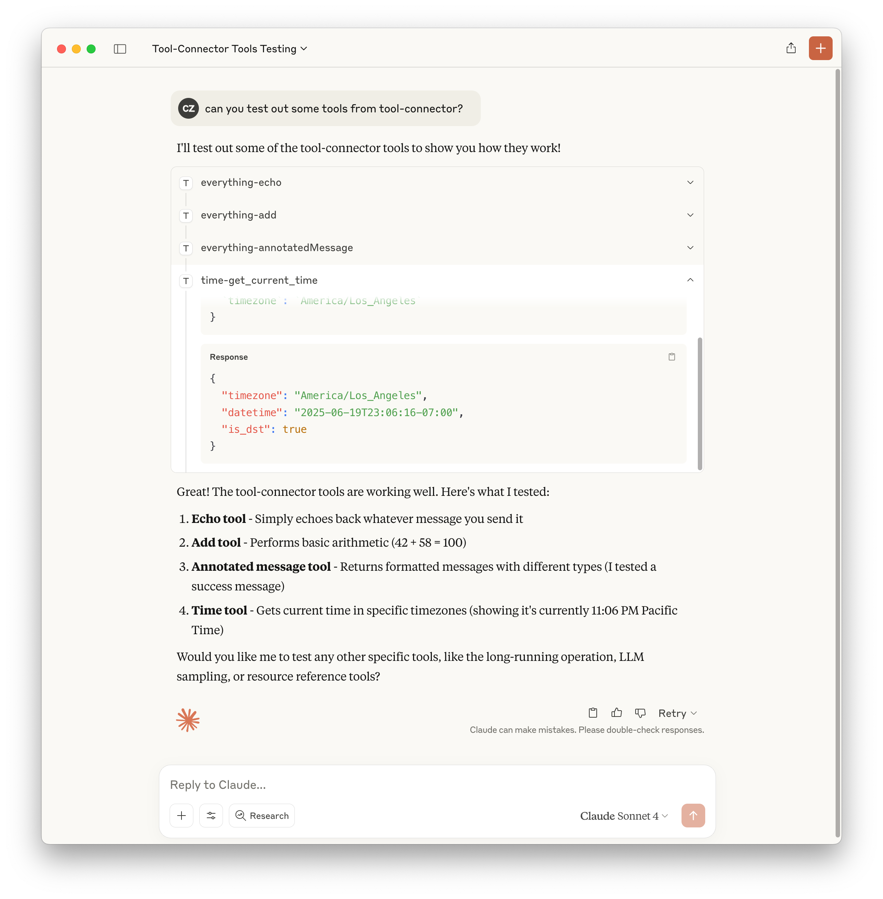
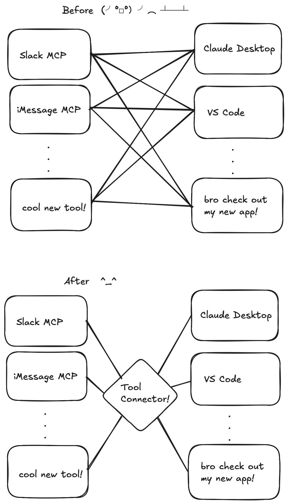

# Tool Connector

This is a work in progress!

The idea is to create a single source for tool integrations that you can set-and-forget with all the AI agent clients on your computer (e.g. Claude Desktop, Cursor, VS Code).

## Why I built this

Everybody seems to have been making their own MCP servers and MCP registries lately, but the user experience across the board is super manual.

Rather than configuring your tools separately in Claude Desktop, VS Code, and any other app you want to use, you can use Tool Connector.

Setup your tools once on Tool Connector. Setup Tool Connector once in Claude Desktop, VS Code, etc.

Now each new integration connects to every app on your computer and every new app connects to every integration. Simplicity!

## Development

This is an Electron.js app. Just run `npm install` and then `npm start` in the root of this repository to check it out.

### Goals

#### Capabilities

[x] 🛠️ Basic configuration and MCP integration

[x] 🔒 Encrypt configs (no plain text API keys!)

[ ] 🔑 OAuth support

[ ] 💬 Chat completion support

#### User Experience

[ ] 🌑 Dark mode

[ ] 🚚 Import+Export integration with Claude Desktop and VS Code

[ ] 🔎 Nav sidebar

[ ] 💫 Improve session management when changing configs

[ ] 📦 Move server out of main process

[ ] 🚀 Package and publish!

#### Observability

[ ] 🩺 Tool health

[ ] 📊 Tool usage tracking
